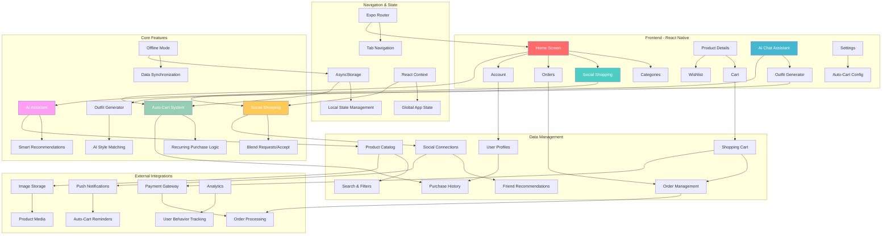

```mermaid

graph TB
    %% User Interface Layer
    subgraph "Frontend - React Native"
        A[Home Screen] --> B[Categories]
        A --> C[Social Shopping]
        A --> D[Orders]
        A --> E[Account]

        F[Product Details] --> G[Cart]
        F --> H[Wishlist]

        I[AI Chat Assistant] --> J[Outfit Generator]
        K[Settings] --> L[Auto-Cart Config]
    end

    %% Navigation Layer
    subgraph "Navigation & State"
        M[Expo Router] --> N[Tab Navigation]
        O[AsyncStorage] --> P[Local State Management]
        Q[React Context] --> R[Global App State]
    end

    %% Core Features
    subgraph "Core Features"
        S[Auto-Cart System] --> T[Recurring Purchase Logic]
        U[Social Shopping] --> V[Blend Requests/Accept]
        W[AI Assistant] --> X[Smart Recommendations]
        Y[Offline Mode] --> Z[Data Synchronization]
        AA[Outfit Generator] --> BB[AI Style Matching]
    end

    %% Data Layer
    subgraph "Data Management"
        CC[Product Catalog] --> DD[Search & Filters]
        EE[User Profiles] --> FF[Purchase History]
        GG[Shopping Cart] --> HH[Order Management]
        II[Social Connections] --> JJ[Friend Recommendations]
    end

    %% External Services
    subgraph "External Integrations"
        KK[Payment Gateway] --> LL[Order Processing]
        MM[Push Notifications] --> NN[Auto-Cart Reminders]
        OO[Image Storage] --> PP[Product Media]
        QQ[Analytics] --> RR[User Behavior Tracking]
    end

    %% Connections
    A --> S
    C --> U
    I --> W
    J --> AA
    G --> GG
    D --> HH
    E --> EE

    M --> A
    O --> S
    Q --> U

    S --> FF
    U --> II
    W --> CC
    Y --> O

    CC --> OO
    GG --> KK
    HH --> LL
    II --> MM

    style A fill:#FF6B6B,color:#fff
    style C fill:#4ECDC4,color:#fff
    style I fill:#45B7D1,color:#fff
    style S fill:#96CEB4,color:#fff
    style U fill:#FECA57,color:#fff
    style W fill:#FF9FF3,color:#fff

```
