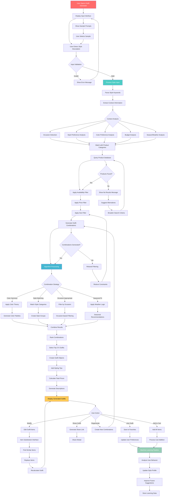

```mermaid
flowchart TD
    A[User Opens Outfit Generator] --> B[Display Input Interface]
    B --> C[User Enters Style Description]

    C --> D{Input Validation}
    D -->|Invalid| E[Show Error Message]
    D -->|Valid| F[Process Style Input]

    E --> B

    F --> G[Parse Style Keywords]
    G --> H[Extract Context Information]
    H --> I{Context Analysis}

    I --> J[Occasion Detection]
    I --> K[Style Preference Analysis]
    I --> L[Color Preference Analysis]
    I --> M[Budget Analysis]
    I --> N[Season/Weather Analysis]

    %% Processing Pipeline
    J --> O[Match with Product Categories]
    K --> O
    L --> O
    M --> O
    N --> O

    O --> P[Query Product Database]
    P --> Q[Apply Availability Filter]
    Q --> R[Apply Price Filter]
    R --> S[Apply Size Filter]

    S --> T[Generate Outfit Combinations]
    T --> U[Algorithm Processing]

    %% AI Recommendation Engine
    U --> V{Combination Strategy}
    V -->|Color Harmony| W[Apply Color Theory]
    V -->|Style Matching| X[Match Style Categories]
    V -->|Occasion Appropriate| Y[Filter by Occasion]
    V -->|Seasonal Fit| Z[Apply Weather Logic]

    W --> AA[Generate Color Palettes]
    X --> BB[Create Style Groups]
    Y --> CC[Occasion-based Filtering]
    Z --> DD[Seasonal Recommendations]

    AA --> EE[Combine Results]
    BB --> EE
    CC --> EE
    DD --> EE

    EE --> FF[Rank Combinations]
    FF --> GG[Select Top 3-5 Outfits]

    GG --> HH[Create Outfit Objects]
    HH --> II[Add Styling Tips]
    II --> JJ[Calculate Total Prices]
    JJ --> KK[Generate Descriptions]

    KK --> LL[Display Generated Outfits]

    %% User Interactions
    LL --> MM{User Action}
    MM -->|Like Outfit| NN[Save to Favorites]
    MM -->|Add to Cart| OO[Add All Items]
    MM -->|Share Outfit| PP[Generate Share Link]
    MM -->|Regenerate| QQ[Create New Combinations]
    MM -->|Modify| RR[Edit Outfit Items]

    NN --> SS[Update User Preferences]
    OO --> TT[Process Cart Addition]
    PP --> UU[Share Modal]
    QQ --> T
    RR --> VV[Item Substitution Interface]

    VV --> WW[Find Similar Items]
    WW --> XX[Replace Items]
    XX --> YY[Recalculate Outfit]
    YY --> LL

    %% Learning System
    SS --> ZZ[Machine Learning Pipeline]
    TT --> ZZ

    ZZ --> AAA[Analyze User Behavior]
    AAA --> BBB[Update Style Profile]
    BBB --> CCC[Improve Future Suggestions]
    CCC --> DDD[Store Learning Data]

    %% Error Handling
    P --> EEE{Products Found?}
    EEE -->|No| FFF[Show No Results Message]
    EEE -->|Yes| Q

    FFF --> GGG[Suggest Alternatives]
    GGG --> HHH[Broaden Search Criteria]
    HHH --> P

    T --> III{Combinations Generated?}
    III -->|No| JJJ[Relaxed Filtering]
    III -->|Yes| U

    JJJ --> KKK[Reduce Constraints]
    KKK --> S

    %% Sample Prompts Feature
    B --> LLL[Show Sample Prompts]
    LLL --> MMM[User Selects Sample]
    MMM --> C

    style A fill:#FF6B6B,color:#fff
    style F fill:#4ECDC4,color:#fff
    style U fill:#45B7D1,color:#fff
    style ZZ fill:#96CEB4,color:#fff
    style LL fill:#FECA57,color:#000
```
