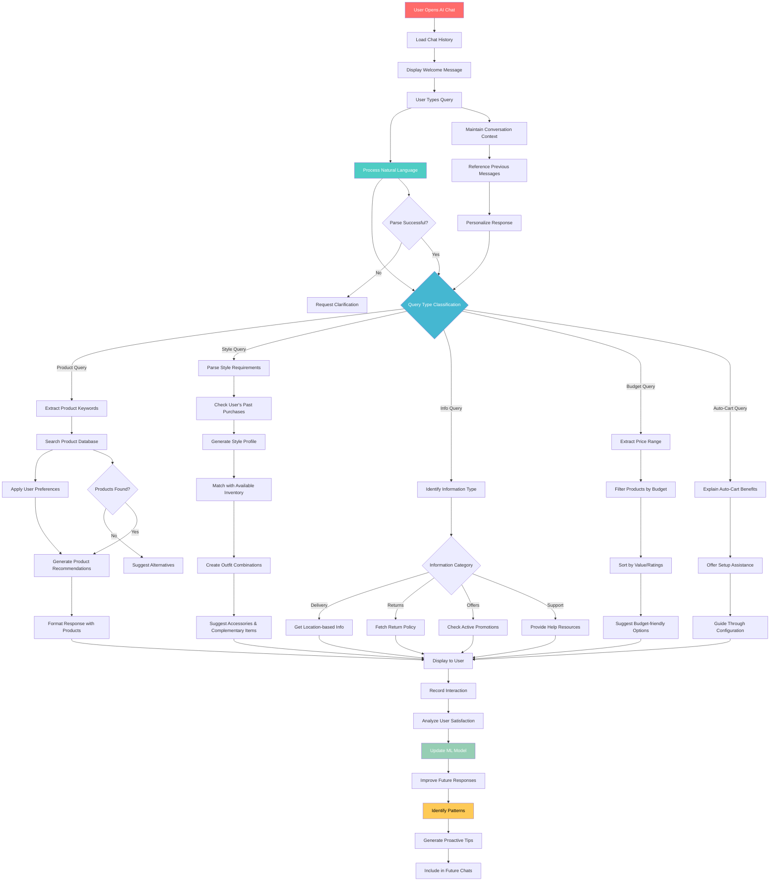

```mermaid
flowchart TD
A[User Opens AI Chat] --> B[Load Chat History]
B --> C[Display Welcome Message]

    C --> D[User Types Query]
    D --> E[Process Natural Language]

    E --> F{Query Type Classification}

    %% Product Search Path
    F -->|Product Query| G[Extract Product Keywords]
    G --> H[Search Product Database]
    H --> I[Apply User Preferences]
    I --> J[Generate Product Recommendations]
    J --> K[Format Response with Products]
    K --> L[Display to User]

    %% Style/Outfit Query Path
    F -->|Style Query| M[Parse Style Requirements]
    M --> N[Check User's Past Purchases]
    N --> O[Generate Style Profile]
    O --> P[Match with Available Inventory]
    P --> Q[Create Outfit Combinations]
    Q --> R[Suggest Accessories & Complementary Items]
    R --> L

    %% Information Query Path
    F -->|Info Query| S[Identify Information Type]
    S --> T{Information Category}
    T -->|Delivery| U[Get Location-based Info]
    T -->|Returns| V[Fetch Return Policy]
    T -->|Offers| W[Check Active Promotions]
    T -->|Support| X[Provide Help Resources]

    U --> L
    V --> L
    W --> L
    X --> L

    %% Budget Query Path
    F -->|Budget Query| Y[Extract Price Range]
    Y --> Z[Filter Products by Budget]
    Z --> AA[Sort by Value/Ratings]
    AA --> BB[Suggest Budget-friendly Options]
    BB --> L

    %% Auto-Cart Query Path
    F -->|Auto-Cart Query| CC[Explain Auto-Cart Benefits]
    CC --> DD[Offer Setup Assistance]
    DD --> EE[Guide Through Configuration]
    EE --> L

    %% Learning & Improvement
    L --> FF[Record Interaction]
    FF --> GG[Analyze User Satisfaction]
    GG --> HH[Update ML Model]
    HH --> II[Improve Future Responses]

    %% Context Management
    D --> JJ[Maintain Conversation Context]
    JJ --> KK[Reference Previous Messages]
    KK --> LL[Personalize Response]
    LL --> F

    %% Error Handling
    E --> MM{Parse Successful?}
    MM -->|No| NN[Request Clarification]
    MM -->|Yes| F

    H --> OO{Products Found?}
    OO -->|No| PP[Suggest Alternatives]
    OO -->|Yes| J

    %% Proactive Suggestions
    II --> QQ[Identify Patterns]
    QQ --> RR[Generate Proactive Tips]
    RR --> SS[Include in Future Chats]

    style A fill:#FF6B6B,color:#fff
    style E fill:#4ECDC4,color:#fff
    style F fill:#45B7D1,color:#fff
    style HH fill:#96CEB4,color:#fff
    style QQ fill:#FECA57,color:#000

```
