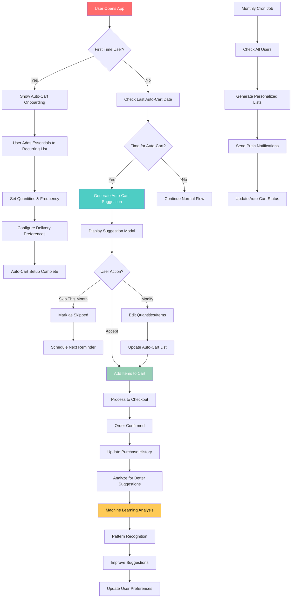

```mermaid
flowchart TD
    A[User Opens App] --> B{First Time User?}

    B -->|Yes| C[Show Auto-Cart Onboarding]
    B -->|No| D[Check Last Auto-Cart Date]

    C --> E[User Adds Essentials to Recurring List]
    E --> F[Set Quantities & Frequency]
    F --> G[Configure Delivery Preferences]
    G --> H[Auto-Cart Setup Complete]

    D --> I{Time for Auto-Cart?}
    I -->|Yes| J[Generate Auto-Cart Suggestion]
    I -->|No| K[Continue Normal Flow]

    J --> L[Display Suggestion Modal]
    L --> M{User Action?}

    M -->|Accept| N[Add Items to Cart]
    M -->|Skip This Month| O[Mark as Skipped]
    M -->|Modify| P[Edit Quantities/Items]

    N --> Q[Process to Checkout]
    O --> R[Schedule Next Reminder]
    P --> S[Update Auto-Cart List]

    S --> N
    Q --> T[Order Confirmed]
    T --> U[Update Purchase History]
    U --> V[Analyze for Better Suggestions]

    %% Background Process
    W[Monthly Cron Job] --> X[Check All Users]
    X --> Y[Generate Personalized Lists]
    Y --> Z[Send Push Notifications]
    Z --> AA[Update Auto-Cart Status]

    %% Learning Algorithm
    V --> BB[Machine Learning Analysis]
    BB --> CC[Pattern Recognition]
    CC --> DD[Improve Suggestions]
    DD --> EE[Update User Preferences]

    style A fill:#FF6B6B,color:#fff
    style J fill:#4ECDC4,color:#fff
    style N fill:#96CEB4,color:#fff
    style BB fill:#FECA57,color:#000
```
