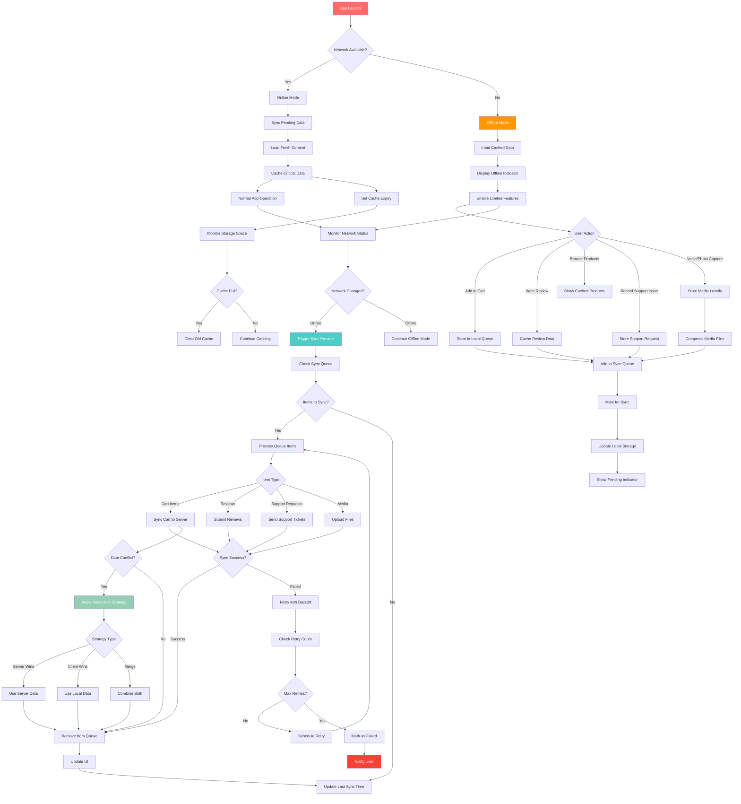

```mermaid
flowchart TD
A[App Launch] --> B{Network Available?}

    B -->|Yes| C[Online Mode]
    B -->|No| D[Offline Mode]

    %% Online Mode
    C --> E[Sync Pending Data]
    E --> F[Load Fresh Content]
    F --> G[Cache Critical Data]
    G --> H[Normal App Operation]

    %% Offline Mode
    D --> I[Load Cached Data]
    I --> J[Display Offline Indicator]
    J --> K[Enable Limited Features]

    %% Offline Actions
    K --> L{User Action}
    L -->|Add to Cart| M[Store in Local Queue]
    L -->|Write Review| N[Cache Review Data]
    L -->|Browse Products| O[Show Cached Products]
    L -->|Record Support Issue| P[Store Support Request]
    L -->|Voice/Photo Capture| Q[Store Media Locally]

    %% Queue Management
    M --> R[Add to Sync Queue]
    N --> R
    P --> R
    Q --> S[Compress Media Files]
    S --> R

    R --> T[Mark for Sync]
    T --> U[Update Local Storage]
    U --> V[Show Pending Indicator]

    %% Network Detection
    H --> W[Monitor Network Status]
    K --> W

    W --> X{Network Changed?}
    X -->|Online| Y[Trigger Sync Process]
    X -->|Offline| Z[Continue Offline Mode]

    %% Sync Process
    Y --> AA[Check Sync Queue]
    AA --> BB{Items to Sync?}
    BB -->|Yes| CC[Process Queue Items]
    BB -->|No| DD[Update Last Sync Time]

    CC --> EE{Item Type}
    EE -->|Cart Items| FF[Sync Cart to Server]
    EE -->|Reviews| GG[Submit Reviews]
    EE -->|Support Requests| HH[Send Support Tickets]
    EE -->|Media| II[Upload Files]

    FF --> JJ{Sync Success?}
    GG --> JJ
    HH --> JJ
    II --> JJ

    JJ -->|Success| KK[Remove from Queue]
    JJ -->|Failed| LL[Retry with Backoff]

    KK --> MM[Update UI]
    LL --> NN[Check Retry Count]
    NN --> OO{Max Retries?}
    OO -->|No| PP[Schedule Retry]
    OO -->|Yes| QQ[Mark as Failed]

    MM --> DD
    PP --> CC
    QQ --> RR[Notify User]

    %% Conflict Resolution
    FF --> SS{Data Conflict?}
    SS -->|Yes| TT[Apply Resolution Strategy]
    SS -->|No| KK

    TT --> UU{Strategy Type}
    UU -->|Server Wins| VV[Use Server Data]
    UU -->|Client Wins| WW[Use Local Data]
    UU -->|Merge| XX[Combine Both]

    VV --> KK
    WW --> KK
    XX --> KK

    %% Cache Management
    G --> YY[Set Cache Expiry]
    YY --> ZZ[Monitor Storage Space]
    ZZ --> AAA{Cache Full?}
    AAA -->|Yes| BBB[Clear Old Cache]
    AAA -->|No| CCC[Continue Caching]

    style A fill:#FF6B6B,color:#fff
    style D fill:#FF9800,color:#fff
    style Y fill:#4ECDC4,color:#fff
    style TT fill:#96CEB4,color:#fff
    style RR fill:#F44336,color:#fff

```
