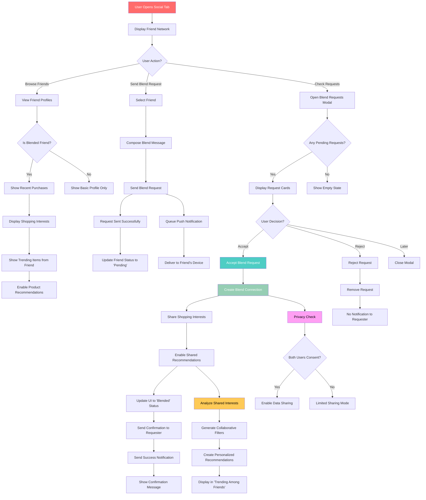

```mermaid
flowchart TD
    A[User Opens Social Tab] --> B[Display Friend Network]

    B --> C{User Action?}
    C -->|Browse Friends| D[View Friend Profiles]
    C -->|Send Blend Request| E[Select Friend]
    C -->|Check Requests| F[Open Blend Requests Modal]

    %% Sending Blend Requests
    E --> G[Compose Blend Message]
    G --> H[Send Blend Request]
    H --> I[Request Sent Successfully]
    I --> J[Update Friend Status to 'Pending']

    %% Receiving Blend Requests
    F --> K{Any Pending Requests?}
    K -->|Yes| L[Display Request Cards]
    K -->|No| M[Show Empty State]

    L --> N{User Decision?}
    N -->|Accept| O[Accept Blend Request]
    N -->|Reject| P[Reject Request]
    N -->|Later| Q[Close Modal]

    %% Accept Process
    O --> R[Create Blend Connection]
    R --> S[Share Shopping Interests]
    S --> T[Enable Shared Recommendations]
    T --> U[Update UI to 'Blended' Status]
    U --> V[Send Confirmation to Requester]

    %% Reject Process
    P --> W[Remove Request]
    W --> X[No Notification to Requester]

    %% Blended Experience
    D --> Y{Is Blended Friend?}
    Y -->|Yes| Z[Show Recent Purchases]
    Y -->|No| AA[Show Basic Profile Only]

    Z --> BB[Display Shopping Interests]
    BB --> CC[Show Trending Items from Friend]
    CC --> DD[Enable Product Recommendations]

    %% Discovery Algorithm
    T --> EE[Analyze Shared Interests]
    EE --> FF[Generate Collaborative Filters]
    FF --> GG[Create Personalized Recommendations]
    GG --> HH[Display in 'Trending Among Friends']

    %% Privacy & Safety
    R --> II[Privacy Check]
    II --> JJ{Both Users Consent?}
    JJ -->|Yes| KK[Enable Data Sharing]
    JJ -->|No| LL[Limited Sharing Mode]

    %% Notification System
    H --> MM[Queue Push Notification]
    V --> NN[Send Success Notification]
    MM --> OO[Deliver to Friend's Device]
    NN --> PP[Show Confirmation Message]

    style A fill:#FF6B6B,color:#fff
    style O fill:#4ECDC4,color:#fff
    style R fill:#96CEB4,color:#fff
    style EE fill:#FECA57,color:#000
    style II fill:#FF9FF3,color:#000
```
